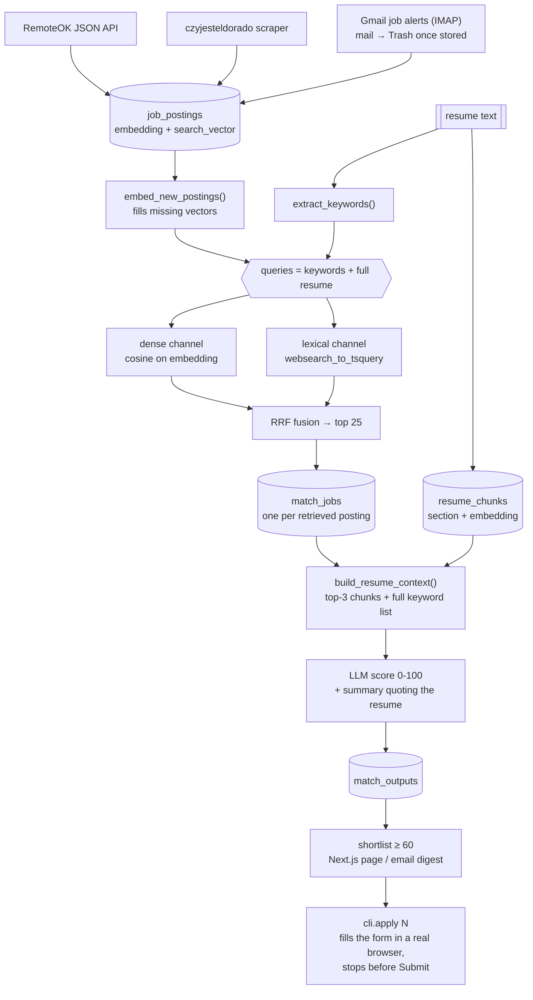

# Architecture

One weekly run, one user. Postings come in from several sources, retrieval picks
the handful worth an LLM call, the scorer sees only the resume sections that
answer each posting.

## What does what

| Module | Responsibility |
| --- | --- |
| `services/ingest_remoteok.py` | RemoteOK's free JSON feed → posting rows |
| `services/ingest_eldorado.py` | czyjesteldorado search + detail pages → posting rows |
| `services/ingest_gmail.py` | IMAP read of job-alert senders, LLM extraction per mail, mail → Trash after storing |
| `database/operations/job_posting.py` | upsert on `(source, source_id)` — reruns refresh, never duplicate |
| `services/extract_keywords.py` | resume → ≤10 search keywords (also the "complete skill list" the scorer trusts) |
| `services/embeddings.py` | batched embedding calls, 8k-char input cap |
| `services/retrieve.py` | dense + lexical ranking per query, RRF fusion, backfill of posting vectors |
| `services/resume_chunks.py` | resume → sections → embeddings; per-posting context assembly |
| `services/match.py` | MatchJob lifecycle, the scoring prompt, shortlist query |
| `services/pipeline.py` | the weekly run, in order; shared by CLI and HTTP |
| `endpoints/profile.py` | the stored CV: markdown/plain text, or a PDF whose text layer is extracted here |
| `endpoints/pipeline.py` | `POST /pipeline/run`, `GET /pipeline/status`, `GET /shortlist` (paged) |
| `cli/match_pipeline.py` | the weekly entrypoint a cron actually calls |
| `cli/ingest_gmail.py` | the daily mail-only entrypoint |
| `cli/apply.py` | opens a shortlisted offer's form in a real browser, fills it, stops before Submit |

## Where the cost is

Embeddings are rounding-error cheap; the scoring call is not. Two things bound it:
retrieval caps how many postings get scored (`retrieval_top_k`, default 50), and
`build_resume_context` sends 3 resume sections instead of the whole CV.

`match_jobs` rows are never re-scored, so a rerun on the same day costs almost nothing.
