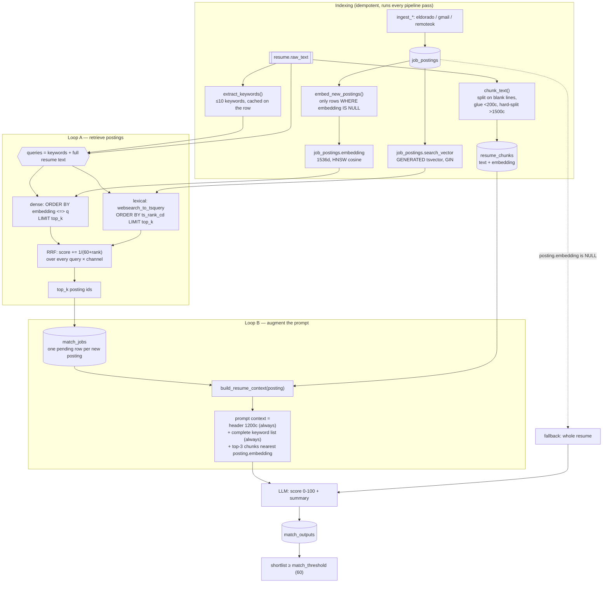

# RAG in this project

Two retrieval loops, not one. They use the same embedding space and the same
Postgres instance, and they point in opposite directions:

| | Loop A — pick postings | Loop B — pick resume sections |
| --- | --- | --- |
| Question | which of ~thousands of postings deserve an LLM call? | which parts of the CV answer *this* posting? |
| Corpus | `job_postings` | `resume_chunks` |
| Query | each resume keyword + the full resume text | the posting's own embedding (no extra call) |
| Channels | dense (pgvector cosine) + lexical (`tsvector`), fused with RRF | dense only |
| Cut | top `retrieval_top_k` (default 50) | top `resume_context_chunks` (default 3) |
| Code | `services/retrieve.py` | `services/resume_chunks.py` |

Generation is a single call: `services/match.py::_score` — 0-100 plus a summary
quoting the resume. No agent, no chain, no framework. Rationale and rejected
alternatives are in [ADR 0001](adr/0001-hybrid-retrieval-over-pgvector.md).

## Flow

## The parts that are load-bearing

**RRF over a weighted blend.** Cosine distance and `ts_rank_cd` are on unrelated
scales. RRF reads ranks only, so there is nothing to recalibrate when either
side changes. `RRF_K = 60`, `retrieve.py:21`.

**The resume itself is a query.** `pipeline.py:67` passes
`[*resume.keywords, resume_text]`. Keywords catch exact technology names;
the full text catches good fits worded in vocabulary no keyword covers.

**Two thirds of the "retrieved" context is not retrieved.** Header and full
keyword list go in unconditionally (`_format_context`, `resume_chunks.py:98`).
Retrieval only supplies prose evidence. Skipping this made the scorer count
tenure from the sections it happened to see and rate a 92 posting as 44 — see
ADR 0001's consequences.

**Everything is idempotent, nothing is re-done.** Same resume text reuses the
`Resume` row (keywords + chunks extracted once), postings embed only when
`embedding IS NULL`, and a posting with an existing `MatchJob` is never
re-scored. A rerun the same day costs close to nothing.

## Knobs

`api/.env` → `config.py`:

- `embedding_model` (`text-embedding-3-small`, 1536d) — changing it invalidates
  **both** corpora; postings and resume chunks must be re-embedded together, and
  `EMBED_DIM` needs a migration.
- `retrieval_top_k` (50) — hard cap on postings that ever reach the scorer, so
  it sets both shortlist size and per-run LLM cost.
- `resume_context_chunks` (3) — resume sections per scoring prompt.
- `match_threshold` (60) — shortlist cutoff, post-generation, not retrieval.

## Known gaps

- No eval harness. Recall@k for hybrid vs dense-only is reasoned, not measured;
  labels from existing `match_outputs` would be circular (ADR 0001).
- No re-ranker between retrieval and scoring — the LLM score *is* the re-rank.
- No vector index on `resume_chunks` (a few dozen rows; seq scan wins).
- `README.md` and `docs/architecture.md`'s diagram still say "top 25";
  `retrieval_top_k` is 50.
